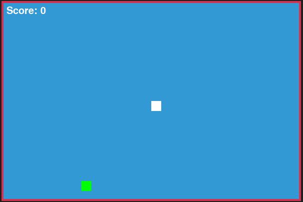

# Snake Game 🐍

A classic Snake game built with **Python** and **Pygame**. Control the snake to eat food, grow longer, and avoid crashing into walls, the border, or yourself. Supports full-screen mode with a fixed playable area marked by a red border. Perfect for practicing Python programming and game development fundamentals.

## Features
- Classic snake movement using arrow keys
- Score tracking
- Game over screen with option to restart (`C`) or quit (`Q`)
- Full-screen support with a distinct playable area
- Red border around the playable area for clarity
- Simple and clean color scheme
- Integer-based movement to prevent accidental losses
- Easy to extend with new features (walls, power-ups, AI)

<p float="left">
  
  
</p>


## Installation

1. Clone the repository:

```bash
git clone https://github.com/sobhankohanpour/python-mini-projects.git
```

2. Navigate to the `games` folder:

```bash
cd python-mini-projects/games/snake_game
```

3. (Optional but recommended) Create a new Conda environment (Python 3.11 as example):

```bash
conda create -n snake_game_env python=3.11
```

4. Activate the environment:
```bash
conda activate snake_game_env
```

5. Install Pygame inside the Conda environment:

```bash
pip install pygame
```
## Usage

Run the game:

```bash
python snake_game.py
```

- **Arrow keys**: Move the snake
- **C**: Restart the game after losing
- **Q**: Quit the game

## Project Structure

```
snake_game/
├── images/
├── snake_game.py
└── README.md
```

## Contributing

Feel free to fork and improve this project. Ideas for enhancements:

- Obstacles and walls
- Special food items with bonuses
- Multiplayer mode
- AI-controlled snake
