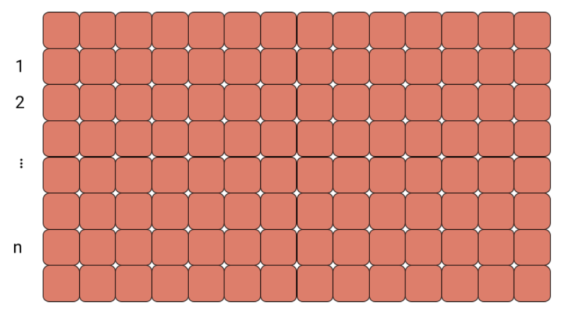
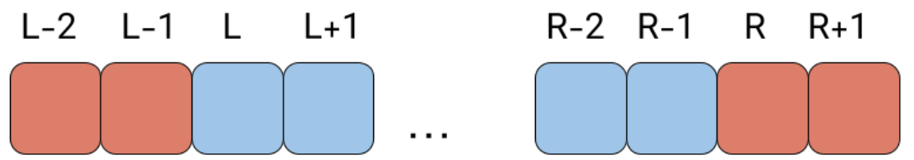
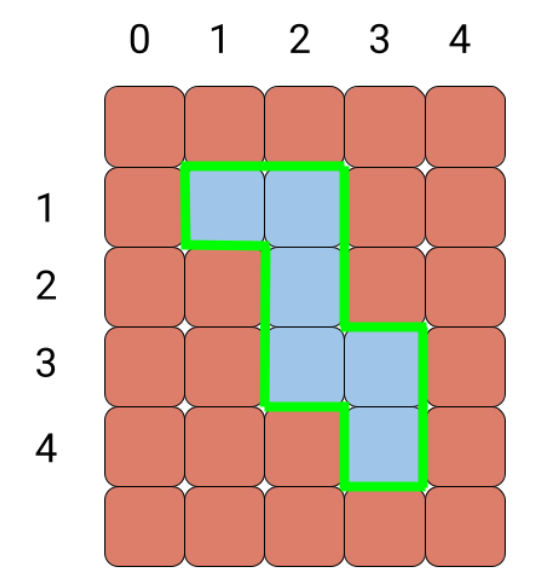
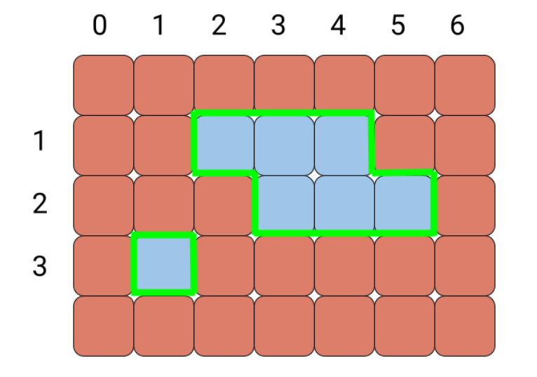

# Shaparak Wall Painting Perimeter Calculator 🖌️

## Project Overview

This project simulates a real-world scenario at **Shaparak (Electronic Payment Network Company)**, where a professional painter paints sections of a large wall composed of square 1×1 bricks arranged in rows.



The painter selects **n consecutive rows** and colors intervals of bricks in each row. For the **i-th row**, the painted bricks are numbered from **lᵢ** to **rᵢ - 1**.



After painting, the painter wants to calculate the **total perimeter** of the painted regions to carefully outline their borders.


## Problem Description

**Input:**

* The first line contains an integer **n** (1 ≤ n ≤ 100), the number of painted rows.
* Each of the next **n** lines contains two integers **lᵢ** and **rᵢ** (1 ≤ lᵢ < rᵢ ≤ 100), representing the start and end of the painted interval in the i-th row.

**Output:**

* A single integer representing the total perimeter of all painted regions.

**Example 1:**

```
Input:
4
1 3
2 3
2 4
3 4
```



```
Output:
14
```

**Example 2:**

```
Input:
3
2 5
3 6
1 2
```



```
Output:
16
```

## How It Works

1. Calculate the total perimeter of each painted brick assuming no shared walls:
   * Each brick has a perimeter of 4.
   * Sum all individual brick perimeters.

2. Subtract the overlapping walls:
   * Horizontal shared walls: adjacent bricks in the same row share walls.
   * Vertical shared walls: bricks stacked vertically across consecutive rows share walls.
   * Each shared wall reduces the total perimeter by 2.

3. Return the **adjusted total perimeter** after removing all shared walls.

